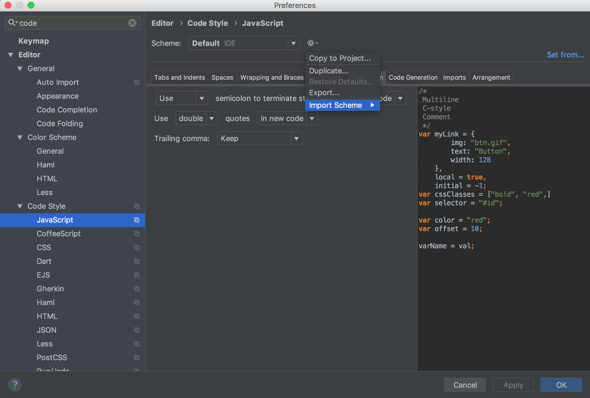

# HOW TO IMPORT _ZALARI_ CODE STYLES in IntelliJ IDEs

* [download actual code style](https://github.com/zalari/codestyles/raw/master/code-style.xml)
* click (WebStorm|IntelliJ) -> Preferences
* search for _Code Style_
* click on the settings cog and _Import Scheme_ -> _IntelliJ..._ and select the **downloaded** `code-style.xml` and _apply_

